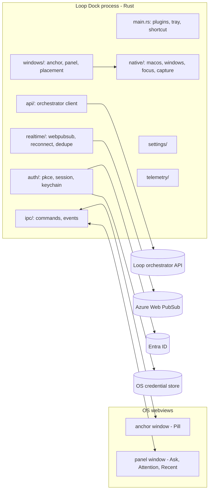
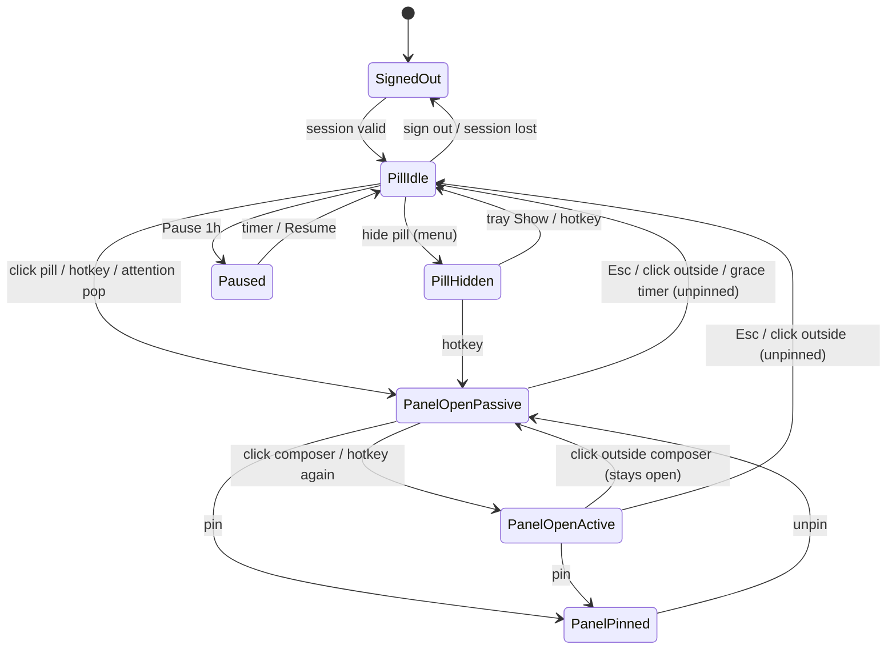
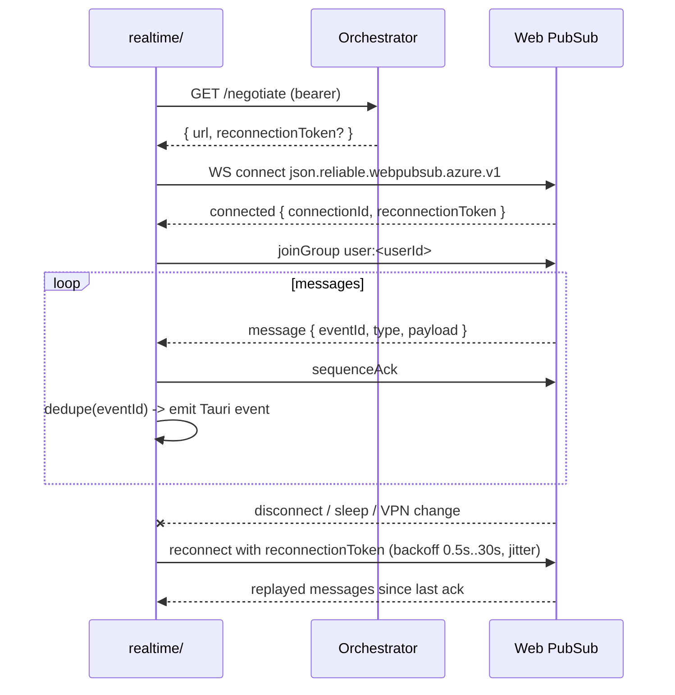

# Loop Dock — Shell Architecture

| | |
|---|---|
| **Status** | Draft v0.5 |
| **Last updated** | 20 September 2026 |
| **Owner** | Loop Platform Team |
| **Audience** | Shell engineer · UI engineer · Security · Endpoint engineering |
| **Related** | [design-brief.md](design-brief.md) · [ui-ux.md](ui-ux.md) · [system-architecture.md](system-architecture.md) · [technology.md](technology.md) · [ADR-001](adr/ADR-001-shell-stack.md) · [ADR-002](adr/ADR-002-auth-flow.md) · [ADR-003](adr/ADR-003-anchor-and-panel-model.md) · [ADR-004](adr/ADR-004-packaging-and-updates.md) · [ADR-005](adr/ADR-005-edge-tab-hover-reveal.md) |

This document owns how the dock is built as a desktop process: windows, focus, native behaviour, IPC, networking, security, budgets and the test matrix. Interaction and visual behaviour are specified in `ui-ux.md`; this document says how the shell delivers them.

---

## 1. Process topology

The webviews are renderers. They call Rust commands and subscribe to Rust events. They have no network access to Loop backends (CSP `connect-src 'none'`), no tokens and no persistent storage of Loop data.

---

## 2. Windows

Two Tauri windows with fixed labels. No other window is ever created; dialogs, settings and toasts render inside `panel`.

| | `anchor` (pill) | `panel` |
|---|---|---|
| Content | Loop mark, Ask / Attention / Recent buttons, Attention badge | Header (mode title, pin, overflow), mode body, composer |
| Logical size | Tab 20 × 180 px; pill 56 × 180 px. Window matches the visible chrome (ADR-005) | 380 x 640 px (clamped to work area height minus 48 px) |
| `decorations` | false | false |
| `transparent` | true (rounded pill drawn by CSS) | true (rounded corners drawn by CSS) |
| `shadow` | false | false |
| `alwaysOnTop` | true | true |
| `skipTaskbar` | true | true |
| `resizable` | false | false |
| `focusable` | false | false at creation; toggled true only for typing |
| `visible` at start | false until session is valid, then true | false |
| `visibleOnAllWorkspaces` (macOS) | true | true |
| Click-through | never | never |
| Capabilities | `core:window:allow-set-position`, `allow-show/hide`, `core:event`, `core:menu:allow-popup` | `core:event`, `core:window:allow-show/hide/set-focus` |

Rationale for two fixed windows over one resizing window: ADR-003 (still in force). The **anchor** window is fixed at the pill size; a window region clips it to the tab when collapsed and Motion slides the chrome inside it (ADR-005). Neither window is resized to animate.

### 2.1 Placement

- The pill lives on the **right edge** of a display. Default display is primary; the user can drag the pill vertically; moving to another display is done from Settings (edge side and display), not by drag.
- Geometry is computed in **physical pixels** from the target monitor's work area and scale factor. All persisted values are logical (DIP) plus a monitor-layout key (`hash(monitor names, positions, scale factors)`).
- Pill (expanded): `x = workArea.right - pillWidth`, `y = clamp(savedY, workArea.top, workArea.bottom - pillHeight)`; default `y` is 40 % of work-area height.
- Tab (collapsed): same Y and height as the pill, `width = 20`, on the screen-edge side of the pill rect. The anchor HWND always spans the pill rect; `anchor_set_expanded(false)` applies a `SetWindowRgn` clip to the tab strip (nothing drawn, clicks fall through outside it) and `anchor_set_expanded(true)` clears it. The UI calls `true` before the chrome slides out and `false` after it has slid back.
- Panel: `x = pill.x - panelWidth - 8`, `y = clamp(pill.centerY - panelHeight * 0.35, workArea.top + 8, workArea.bottom - panelHeight - 8)`. If the panel would overlap the pill's display edge (very narrow displays), it overlaps the pill and the pill hides while the panel is open.
- On `moved`/`scale-factor-changed`/monitor hot-plug events, both windows are re-laid out; if the saved display is gone, fall back to primary and keep the saved key for when it returns.

### 2.2 Vertical drag

Tauri's `start_dragging()` is free-form, so drag is implemented in the pill webview: `pointerdown` anywhere on the tab or pill, buttons included (threshold 4 px), `pointermove` -> `anchor_set_y(deltaLogical)` at most every 16 ms; Rust clamps and calls `set_position` with `x` pinned. `pointerup` persists `y` (top of the *expanded* pill). A press without movement is a click: on a mode button it calls `dock_show { mode }` / `dock_set_mode` (or `dock_hide` when that mode is already open); on the Loop mark it toggles the panel. During drag the panel is hidden.

### 2.3 Panel show/hide

- Show: compute placement, `set_position`, `show()`, emit `dock_state_changed { open: true, mode }`. The webview is already mounted (see §8 on reveal latency), so Motion runs the slide immediately.
- Hide: emit `dock_state_changed { open: false }`, wait for the UI to acknowledge (`dock_hide` is called by the UI after its 160 ms exit animation, or by Rust after a 250 ms timeout), `hide()`, restore focus (§3.3).

---

## 3. Focus and activation

### 3.1 State machine

- **Passive:** the panel is visible but not activated; the previously focused application keeps keyboard focus. Mouse interaction with cards and buttons works (clicks do not activate on either OS because of `WS_EX_NOACTIVATE` / non-activating panel).
- **Active:** the panel has keyboard focus for typing in the composer or free-text reply. Entered only by explicit user action.
- **Paused:** pill dimmed, no Attention pops or toasts; badge still updates.

### 3.2 macOS

- `anchor` and `panel` converted to `NSPanel` (`tauri-nspanel`) with `styleMask |= .nonactivatingPanel`; `hidesOnDeactivate = false`; `collectionBehavior = [.canJoinAllSpaces, .fullScreenAuxiliary, .stationary]`; `level = .floating`.
- App activation policy `.accessory` (no Dock icon, no Cmd-Tab).
- Passive -> Active: `panel.makeKey()` with `becomesKeyOnlyIfNeeded = true`; the app is not activated, so the previous app stays "active" in the menu bar sense while the panel is key. If WKWebView refuses first responder in this configuration (spike verifies), fall back to `NSApp.activate(ignoringOtherApps:)` plus restore.
- Restore: `NSWorkspace.shared.frontmostApplication` captured before making key; `activate(options: [])` on hide if we did activate.

### 3.3 Windows

- Both HWNDs: `SetWindowLongPtr(GWL_EXSTYLE, ex | WS_EX_NOACTIVATE | WS_EX_TOOLWINDOW)` after creation, before first show.
- Passive -> Active: store `GetForegroundWindow()` in `native::focus::PREVIOUS`; call `SetForegroundWindow(panelHwnd)` and `SetFocus`. Because the call follows a click in our own process, Windows grants foreground.
- Restore on hide: if `PREVIOUS` is still a valid, visible window, `SetForegroundWindow(PREVIOUS)`; otherwise do nothing (never activate the desktop or the taskbar).
- Never call `SetForegroundWindow` on show in Passive state.
- Click-outside hide cannot use `on_blur`: Passive never activates, so the panel never blurs. A `WH_MOUSE_LL` hook hides an unpinned panel when the click is outside the pill and panel window rects. Pinned panels stay.

### 3.4 Full-screen, presentation and share

- Full-screen apps: macOS `fullScreenAuxiliary` allows the panel over full-screen Spaces; Windows topmost sits above borderless-fullscreen apps (Office, Teams, browsers). Exclusive-fullscreen D3D apps are not a target.
- Presentation mode: Windows `SHQueryUserNotificationState` in `QUNS_PRESENTATION_MODE | QUNS_BUSY | QUNS_RUNNING_D3D_FULL_SCREEN`, macOS Focus (read via `NSWorkspace` notifications where available, otherwise the user's Pause). In these states: no Attention pops, no toasts, badge still updates, hotkey still works.
- Screen-share exclusion (Settings toggle, default on): Windows `SetWindowDisplayAffinity(WDA_EXCLUDEFROMCAPTURE)` on both HWNDs; macOS `sharingType = .none` on both windows. Consequence: the dock is invisible in recordings and in some RDP capture paths.

---

## 4. Multi-monitor, DPI and power events

| Event | Behaviour |
|---|---|
| Monitor added/removed | Recompute layout key; re-place pill on saved display or primary; hide panel if open. |
| Scale factor changed | Re-place both windows in physical pixels; Motion is not re-run. |
| Work area changed (taskbar moved/hidden) | Re-clamp pill `y` and panel position. |
| Sleep / wake | On wake: re-place windows, resume realtime (§6.2), refresh session if within 5 min of expiry. |
| Lock / unlock | Hide panel on lock (never leave Attention content on a locked-screen transition); restore pill on unlock. |
| Display sleep | No action. |
| Pill dragged to a `y` that no longer exists after layout change | Clamp. |

---

## 5. IPC surface

All commands and events are defined with `tauri-specta`; bindings are generated into `contracts/bindings/`. Payload types are the Zod-derived contract types.

### 5.1 Commands

| Command | Payload | Returns | Notes |
|---|---|---|---|
| `dock_show` | `{ mode?: Mode, reason: 'pill'\|'hotkey'\|'tray'\|'attention'\|'toast' }` | `DockState` | Places and shows the panel. |
| `dock_hide` | `{ reason: 'esc'\|'outside'\|'grace'\|'ui'\|'lock' }` | `DockState` | Restores focus. |
| `dock_pin` | `{ pinned: boolean }` | `DockState` | |
| `dock_set_mode` | `{ mode: Mode }` | `DockState` | Persists last-used mode. |
| `dock_activate` | `{}` | `void` | Passive -> Active (called when the composer is clicked). |
| `anchor_set_y` | `{ yLogical: number, commit: boolean }` | `{ yLogical }` | Clamped; persisted on `commit`. Top of the expanded pill. |
| `anchor_set_expanded` | `{ expanded: boolean }` | `void` | Opens (pill, 56 × 180) or closes (tab strip, 20 × 180) the anchor's window region; the window itself never resizes. |
| `anchor_hide` / `anchor_show` | `{}` | `void` | Pill visibility. |
| `pause_set` | `{ untilEpochMs: number \| null }` | `void` | Pause 1h / resume. |
| `auth_sign_in` | `{}` | `Session` | Opens system browser; resolves on callback. |
| `auth_sign_out` | `{}` | `void` | Clears keychain; emits `session_changed`. |
| `auth_get_session` | `{}` | `Session` | Never includes tokens. |
| `ask_submit` | `{ text: string, journeyId?: string, clientRequestId: string }` | `{ journeyId, taskId }` | Rust posts to orchestrator. |
| `ask_cancel` | `{ taskId: string }` | `void` | |
| `attention_list` | `{}` | `AttentionItem[]` | Initial load; realtime keeps it fresh. |
| `attention_decide` | `AttentionDecision` | `{ accepted: boolean }` | Idempotency key from the UI. |
| `ledger_query` | `{ filters, cursor? }` | `{ rows: LedgerRow[], nextCursor? }` | |
| `journey_get` | `{ journeyId }` | `JourneyThread` | Reopen a thread from Recent. |
| `settings_get` / `settings_set` | `Settings` | `Settings` | Shortcut, edge/display, autostart, theme override, motion, capture exclusion, vibrancy. |
| `open_external` | `{ url }` | `void` | Allow-listed hosts only (systems of record). |
| `telemetry_event` | `{ name, props }` | `void` | UI-side product events. |

### 5.2 Events (Rust -> UI)

| Event | Payload | Source |
|---|---|---|
| `dock_state_changed` | `DockState { open, mode, pinned, active, paused, pillVisible }` | windows/ |
| `theme_changed` | `{ system: 'light'\|'dark' }` | native/ |
| `session_changed` | `Session` | auth/ |
| `connectivity_changed` | `{ state: 'online'\|'reconnecting'\|'offline', sinceEpochMs }` | realtime/ |
| `task_state` | `{ journeyId, taskId, state: A2AState, cards?: Card[], message? }` | realtime/ |
| `attention_new` / `attention_resolved` / `attention_expired` | `AttentionItem` / `{ attentionId }` | realtime/ |
| `ledger_appended` | `LedgerRow` | realtime/ |
| `presentation_changed` | `{ presenting: boolean }` | native/ |
| `settings_requested` | `{}` | tray/ — the tray's "Settings…"; the panel opens its sheet |
| `settings_changed` | `Settings` | ipc/ `settings_set`, windows/ pill visibility — every webview mirrors it, so the anchor follows a theme change made in the panel |

Wire-to-IPC mapping. Web PubSub messages use dotted names; `realtime/` validates them and re-emits the snake_case IPC events above:

| Wire event (Web PubSub) | IPC event |
|---|---|
| `attention.created` | `attention_new` |
| `attention.resolved` | `attention_resolved` |
| `attention.expired` | `attention_expired` |
| `journey.updated` | `task_state` |
| `ledger.appended` | `ledger_appended` |

### 5.3 Error model

`IpcError { code: 'unauthenticated'\|'offline'\|'timeout'\|'rejected'\|'conflict'\|'invalid'\|'internal', message: string, retryable: boolean, correlationId?: string }`. The UI maps codes to the states in `ui-ux.md` §3.6.

---

## 6. Networking, identity and real-time

### 6.1 Rust-owned I/O

- `api/` is the only module holding backend URLs (remote config with a build-time default) and the only `reqwest` client. Every request: bearer token from `auth::session`, `x-journey-id` when known, W3C `traceparent`, 10 s timeout, one retry on idempotent GETs.
- `realtime/` is the only WebSocket client.
- The webview cannot reach any of this except through commands and events.

### 6.2 Web PubSub client

- Heartbeat every 20 s; treat 2 missed as disconnect.
- On wake and on network-change notifications, reconnect immediately (bypass backoff once).
- `connectivity_changed` is emitted on every transition; decisions are blocked in the UI while `offline` (`ui-ux.md` §3.6).

### 6.3 Identity

Auth code + PKCE in `auth/` per ADR-002. Session refresh runs in Rust 5 min before expiry; failures produce `session_changed { state: 'signed_out', reason }` and the UI raises the "Sign in again" Attention item.

---

## 7. Security

- **CSP:** `default-src 'self'; img-src 'self' data:; style-src 'self' 'unsafe-inline'; font-src 'self'; connect-src 'none'; frame-src 'none'; object-src 'none'`.
- **Capabilities:** one file per window, least privilege (§2). No `shell:allow-execute`; `open_external` is a Rust command with a host allow-list.
- **Tokens:** `keyring` only; never logged; never in IPC payloads. `Session` exposes `expiresAt`, not the token.
- **Inbound validation:** Rust deserialises with `serde` (rejecting unknown top-level shapes); the UI re-validates with Zod and drops unknown card types. Malformed input never crashes either layer.
- **Logging redaction:** card bodies, free-text replies and UPNs are never logged above `debug`; Sentry PII scrubber removes them before send.
- **Remote config / kill switch:** `dockPaused`, `disabledAgents[]`, `forceSignOut`, `minVersion` fetched on start and every 5 min; applied without restart.
- **Supply chain:** pinned versions, `cargo audit`, `pnpm audit`, SBOM per release, dependency review in PRs.
- **Screen-share exclusion** default on (§3.4).
- **Lock screen:** panel hidden on session lock.

---

## 8. Budgets and how they are measured

| Metric | Budget | How measured |
|---|---|---|
| Idle CPU, panel hidden | < 0.5 % average over 60 s | OS process monitor on the whole process tree (Rust + webview processes), 1-minute sample, both OSes |
| Resident memory, panel hidden | < 180 MB process tree (Windows), < 150 MB (macOS) | Sum of private working set / RSS over the process tree after 10 min idle |
| Panel reveal, click to first painted frame | < 100 ms p95 | High-speed capture or `PerformanceObserver` first-paint mark after `dock_state_changed`; 50 samples |
| Animation | 60 fps sustained during reveal and mode switch | Chromium/WebKit frame timeline; no frame > 20 ms |
| Cold start to pill visible | < 2 s | Timestamp diff in logs from process start to `anchor.show()` |
| Reconnect after wake | < 5 s to `online` | Log timestamps |

Reveal strategy note: a `visible:false` WebView2 may be throttled and paint slowly on first show. The spike compares (a) hide/show, (b) keep the panel window shown but positioned off-screen with 0 opacity, (c) shown with `set_ignore_cursor_events` off-screen. Choose the cheapest strategy that meets the reveal budget on both OSes, and record it in ADR-003's follow-ups.

---

## 9. Native spike (proves the stack)

Runs before UI investment, on both OSes, with a placeholder pill and panel:

1. Two windows with the flags in §2; pill visible on the right edge; click opens panel beside it.
2. Non-activating: panel opens over full-screen Excel and Outlook; typing continues in the app underneath; clicking a panel button does not activate the dock.
3. Passive -> Active on composer click; typing works in the panel; Esc hides and focus returns to the previous app.
4. Vertical drag with clamping; position persists across restart.
5. Two monitors with different scale factors; DPI change while open; monitor unplug.
6. Screen-share exclusion verified in a Teams share on both OSes.
7. Budgets measured (§8) and recorded.

Go/no-go: all of 1-3 pass on both OSes and 7 is within budget or has a clear path. Otherwise ADR-001 is reopened.

---

## 10. Packaging and runtime environment

Summary; decision and rationale in ADR-004.

- Windows: WiX MSI, per-machine, silent; Trusted Signing; WebView2 Evergreen bootstrapper as dependency; protocol handler and Start-menu shortcut with AppUserModelID; autostart via HKCU Run toggle; Intune Win32 app.
- macOS: signed `.app`, notarized `.pkg`; login item; Jamf policy. Minimum macOS 13.
- No in-app updater for the pilot; MDM pushes new versions. Version and remote-config state reported in telemetry.
- Logs: `%LOCALAPPDATA%\Loop\Dock\logs` and `~/Library/Logs/Loop Dock`, rotated at 5 MB x 5.

---

## Appendix A — Focus and window behaviour test matrix

Run at the spike, at UI integration and at the vertical slice, on both OSes. Expected unless stated: pill visible, panel opens beside it, underlying app keeps keyboard focus in Passive state, no flicker, no orphaned windows, focus returns on hide.

| Scenario | macOS | Windows |
|---|---|---|
| Outlook full-screen / maximised | | |
| Excel full-screen; typing in a cell continues while panel is open (Passive) | | |
| Click composer; type; Esc; focus returns to Excel cell | | |
| PowerPoint slideshow running: no Attention pop, hotkey still opens | | |
| Teams meeting with screen share: dock not visible in the share | | |
| Browser full-screen video | | |
| RDP / Citrix session in foreground | | |
| Lock then unlock: panel hidden on lock, pill restored | | |
| Sleep then wake: windows re-placed, realtime reconnects < 5 s | | |
| Second monitor hot-plugged and removed | | |
| Scale factor changed while panel open | | |
| Pill on monitor B, focused app on monitor A | | |
| Drag pill to top and bottom edges; clamped; persists after restart | | |
| Hide pill from menu; hotkey opens panel; tray Show restores pill | | |
| Pause 1h: badge updates, no pops; resume | | |
| Attention item arrives while panel hidden: pill badge, pop (unless presenting/paused) | | |
| VPN connect / disconnect during an ask: reconnect, no duplicate events | | |
| Session expiry: "Sign in again" Attention item; sign-in via system browser returns to running instance | | |

---

## Changes in v0.5

The anchor HWND no longer resizes. It is fixed at 56 × 180 and `anchor_set_expanded` toggles a `SetWindowRgn` clip to the 20 × 180 tab strip; the chrome slide is Motion inside the window (ADR-005 amendment). Resizing WebView2 per frame left the screen edge bare until Chromium repainted.

## Changes in v0.4

The panel HWND matches the 380 × 640 chrome (no transparent shadow margin). Tab → pill is 180 ms ease-out; pill → tab is 150 ms ease-in.

## Changes in v0.3

The anchor window eases between a 20 × 180 edge tab and the 56 × 180 pill (`anchor_set_expanded`, ADR-005). No extra transparent margin on the anchor.

## Changes in v0.2

The anchor window is the same width as the pill (56 px). The 12 px transparent margin is only above and below, so a DWM fill while dragging does not stick out as a wider bar.

## Changes in v0.1

Initial version. Encodes ADR-003 (pill and panel, two windows, no hover), ADR-002 (PKCE in Rust), ADR-004 (packaging) and the Rust-owned I/O boundary.
