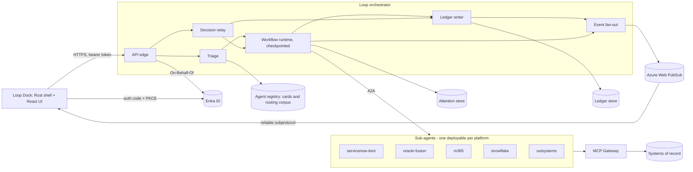
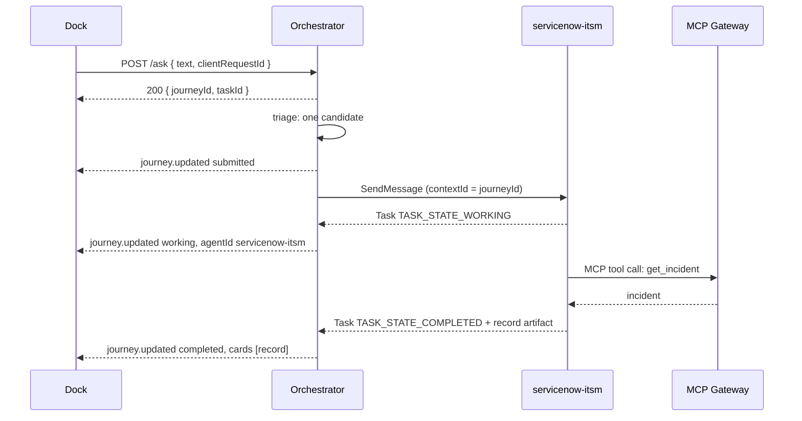
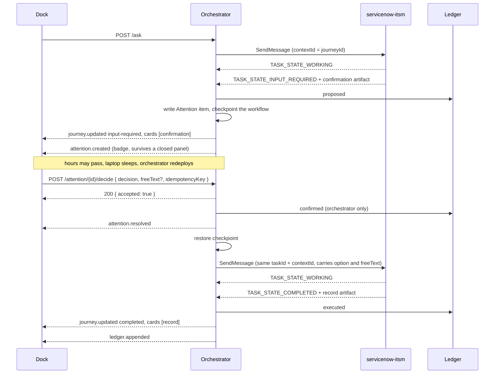
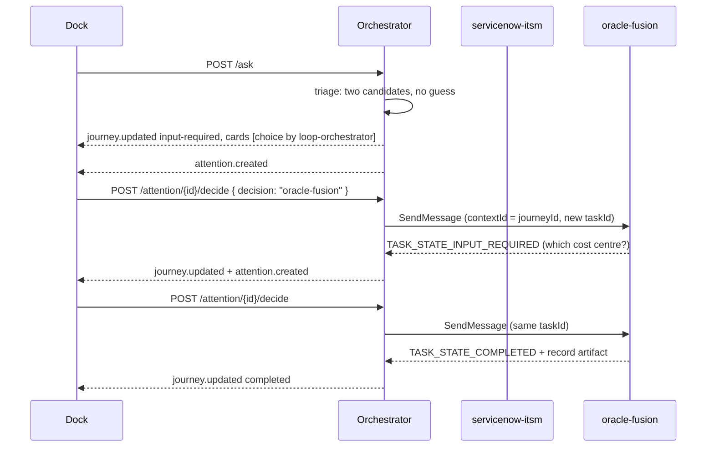
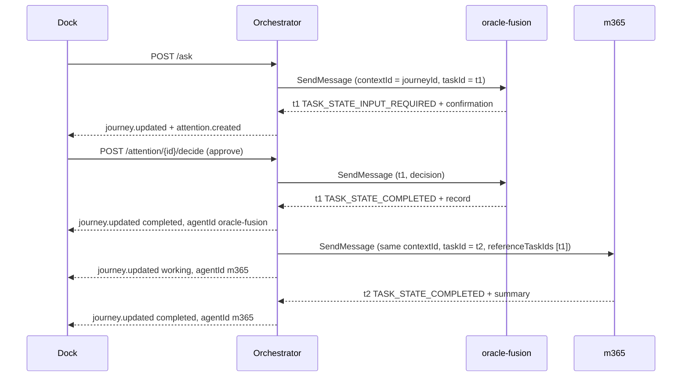

# Loop — System Architecture

| | |
|---|---|
| **Status** | Draft v0.1 |
| **Last updated** | 21 September 2026 |
| **Owner** | Loop Platform Team |
| **Audience** | Loop platform engineers · Orchestrator team · Cloud & AI Team · Security · Sub-agent owners |
| **Related** | [design-brief.md](design-brief.md) · [shell-architecture.md](shell-architecture.md) · [technology.md](technology.md) · [ui-ux.md](ui-ux.md) · [ADR-001](adr/ADR-001-shell-stack.md) · [ADR-002](adr/ADR-002-auth-flow.md) |

This document owns the server side of Loop: every component behind the dock, how the orchestrator functions, and the A2A contract between the orchestrator and the platform sub-agents. It exists because `tools/mock-orchestrator/` is the only executable description of that behaviour today, and a mock is not a specification.

It does not restate the dock. Windows, focus, IPC and budgets are owned by [shell-architecture.md](shell-architecture.md); versions and rationale by [technology.md](technology.md); product scope and the three modes by [design-brief.md](design-brief.md).

---

## 1. Scope and document map

| Question | Answered in |
|---|---|
| What are the components and who owns each | §2, §3 of this document |
| How the real orchestrator triages, executes, records and notifies | §4 |
| Which real component replaces which part of the mock | §5 |
| How the orchestrator talks to sub-agents on the wire | §6 |
| How one ask spans several platforms | §7 |
| What breaks and what the user sees | §8 |
| How the dock is built as a desktop process | [shell-architecture.md](shell-architecture.md) |
| What a card, Attention item or Ledger row looks like | `contracts/schemas/`, `.cursor/rules/contracts.mdc` |

Only the dock lives in this repository. The orchestrator, sub-agents, MCP Gateway, registry, Ledger and Web PubSub hub are separate Azure-hosted services. This document is the interface specification the two sides agree on.

---

## 2. Component inventory

| Component | Owner | Technology | What the dock depends on |
|---|---|---|---|
| **Loop Dock** | Loop Platform Team (this repo) | Tauri 2, Rust, React 19 | — |
| **API edge** | Orchestrator team | Azure-hosted HTTP service | The eight endpoints in §4.1; nothing else |
| **Triage service** | Orchestrator team | Embedding retrieval + LLM choice | That a `choice` card arrives instead of a guess |
| **Workflow runtime** | Orchestrator team | Microsoft Agent Framework, checkpointed | That a paused journey survives sleep and restart |
| **Decision relay** | Orchestrator team | Part of the API edge | Idempotent decisions; HTTP 409 on a second decision |
| **Ledger writer** | Orchestrator team | Append-only writer | That rows are never edited or deleted |
| **Event fan-out** | Orchestrator team | Web PubSub publisher | The five wire event names in §4.6 |
| **Agent registry** | Orchestrator team | Agent Card store + routing corpus | `agentId` values that match `contracts/registry/agents.ts` |
| **Sub-agents** | Platform teams (one per platform) | One deployable each, A2A server | Handoff is attributed to a named agent |
| **MCP Gateway** | Cloud & AI Team | MCP transport, allow-listing, tool logging | Nothing directly |
| **MCP servers** | Platform teams | One or more per platform | Nothing directly |
| **Ledger store** | Orchestrator team | Append-only store, server-side | Identical Recent on every device |
| **Attention store** | Orchestrator team | Queryable by assignee | `GET /attention` returns every open item for this user |
| **Web PubSub hub** | Cloud & AI Team | Azure Web PubSub, reliable subprotocol | Replay on reconnect, dedupe by `eventId` |
| **Entra ID** | Identity team | OAuth 2.0, On-Behalf-Of | Auth code + PKCE per [ADR-002](adr/ADR-002-auth-flow.md) |
| **Telemetry sinks** | Loop Platform Team | Sentry, Application Insights | Traces carry `journeyId` and `taskId` |

Two notes on the registry. `contracts/registry/agents.ts` is a build-time default so a chip always has a name and platform; the orchestrator serves the authoritative registry, and an unknown `agentId` degrades to the id itself rather than failing. `PLATFORMS` in that file drives the Recent filter list, so adding a sub-agent means adding a registry entry even though no dock code changes.

---

## 3. Topology



Three properties of this shape matter:

- **The dock speaks Loop's API, never A2A.** A2A lives entirely between the workflow runtime and the sub-agents. The dock interprets task states it is told about through `contracts/a2a/state-map.ts`; it has no A2A client.
- **The orchestrator contains no platform-specific code.** Every platform call goes through a sub-agent, and every sub-agent tool call goes through the MCP Gateway.
- **Writes fan out through the Ledger.** A state change is recorded before it is announced, so Recent and the live panel cannot disagree.

---

## 4. The orchestrator

### 4.1 API edge

This is the frozen contract between the dock and the orchestrator. It is not a proposal: [src-tauri/src/api/mod.rs](../src-tauri/src/api/mod.rs) already implements exactly these calls, so the real orchestrator must match them for the dock to work unchanged.

| Method and path | Request | Response | Schema |
|---|---|---|---|
| `GET /session` | — | `Session` | `contracts/schemas/session.ts` |
| `GET /negotiate` | — | `{ url, reconnectionToken? }` | §4.6 |
| `POST /ask` | `AskSubmitRequest` | `{ journeyId, taskId }` | `contracts/schemas/ipc.ts` |
| `POST /ask/{taskId}/cancel` | — | `204 No Content` | — |
| `GET /attention` | — | `AttentionItem[]` | `contracts/schemas/attention.ts` |
| `POST /attention/{attentionId}/decide` | `AttentionDecision` | `{ accepted: boolean }` | `contracts/schemas/attention.ts` |
| `GET /ledger` | `?platform=&status=&scope=&cursor=&limit=` | `{ rows, nextCursor? }` | `contracts/schemas/ledger.ts` |
| `GET /journey/{journeyId}` | — | `JourneyThread` | `contracts/schemas/journey.ts` |

Request and response conventions, all already enforced by the Rust client:

- **Headers out:** `Authorization: Bearer <token>`, `x-journey-id` when known, and a W3C `traceparent`. The token comes from the OS keychain and never enters the webview.
- **Headers back:** `x-correlation-id` on every response, success or failure. The dock surfaces it in error states, so it must be present.
- **Timeouts:** 10 s request, 5 s connect. The dock retries a GET once on connect or timeout failure, and retries nothing else, so `POST /ask` and `POST /attention/.../decide` must be safe against a client that gives up and never asks again.
- **Error body:** `{ code, message, retryable }` where `code` is an `IpcErrorCode`. If the body is absent the dock infers a code from the status, so the status must be right even when the body is not: `401` unauthenticated, `403` rejected, `409` conflict, `400`/`404`/`422` invalid, `408`/`504` timeout, `5xx` internal and retryable.
- **`POST /ask` returns before the work is done.** It acknowledges with `{ journeyId, taskId }` and every subsequent state change arrives over Web PubSub. `AskSubmitRequest.clientRequestId` is the dedupe key for a resubmitted ask.
- **`GET /session` is the development and mock path.** With `LOOP_AUTH_MODE=entra` the dock owns the session and this endpoint is informational.

### 4.2 Triage

Triage turns one line of plain language into one sub-agent, or into a question for the user.

1. Embed the ask and retrieve over the routing corpus, which is built from each Agent Card's `skills[].description`, `skills[].tags` and `skills[].examples` (§6.1). Retrieval keeps the prompt a constant size as agents are onboarded, which is why it is retrieval and not a growing list in a system prompt.
2. Give an LLM only the top-k candidate skills and ask it to choose, with "none of these" as an allowed answer.
3. Act on the outcome:

| Outcome | What the orchestrator does |
|---|---|
| One clear candidate | Hand off to that sub-agent (§6.6) and emit `journey.updated` with its `agentId`, which is what renders the handoff chip |
| Two or more plausible candidates | Emit an orchestrator-authored `choice` card and an Attention item, and wait. Never guess between overlapping agents |
| No candidate | Emit a `summary` card with `tone: 'neutral'` explaining that no agent covers this yet, and record the ask for the Loop team |
| Ask spans several platforms | Build a sequential workflow (§7) rather than a single handoff |

The `choice` card is the one card type the orchestrator authors itself; `agentId` on it is `loop-orchestrator`. Its options carry `agentId` (see `DecisionOption` in `contracts/schemas/common.ts`) so the user's pick names the sub-agent directly and no second triage pass is needed.

### 4.3 Workflow runtime

The runtime is Microsoft Agent Framework. Two patterns, chosen by triage:

- **Handoff** for a single-platform ask. Interactive by default: when the acting agent responds without handing off further, control returns to the user.
- **Sequential workflow** for a multi-platform ask, one step per platform (§7).

The property Loop actually depends on is **checkpointing**. Every pause for a human decision is a checkpoint written to durable storage before the Attention item is announced. This is what makes product invariant 6 true — a closed panel does not lose a proposal — and it is also what lets the laptop sleep, the user sign in on a different machine, or the orchestrator be redeployed mid-journey. On restore, pending requests are re-emitted, matched to their open Attention items by `attentionId`, and the workflow continues.

Journey status is derived, never stored twice. The runtime reports an A2A task state; `A2A_TO_JOURNEY` in [contracts/a2a/state-map.ts](../contracts/a2a/state-map.ts) is the single mapping to the `JourneyStatus` the dock renders.

### 4.4 Decision relay

`POST /attention/{attentionId}/decide` carries an `AttentionDecision`: `{ attentionId, decision, freeText?, decidedAt, idempotencyKey }`. `decision` is an `optionId` or the literal `'reject'`.

| Situation | Response | Why |
|---|---|---|
| Item open, first time this `idempotencyKey` is seen | `200 { accepted: true }` | Normal path |
| Same `idempotencyKey` again | `200 { accepted: true }` | The UI reuses the key on retry; a dropped response must not become a second decision |
| Item already decided under a different key | `409 conflict` | Renders as "Already decided elsewhere" — the cross-device case |
| Item expired | `409 conflict` | Expired items are read-only |
| Unknown `attentionId` | `404`, code `invalid` | — |

On acceptance the relay writes the Ledger row before resuming the workflow, appends the decision to the journey's `decisions[]`, stamps `chosenOptionId` or `decidedOptionId` on the originating card so a reopened thread shows what was decided, and publishes `attention.resolved`.

`freeText` is a first-class input, not a comment. "Approve, but ask for the itemised receipt" is relayed to the sub-agent alongside the chosen option, and the sub-agent is expected to act on it. It is also the most sensitive field in the system: never logged above `debug`, scrubbed before Sentry.

### 4.5 Ledger writer

The Ledger is the audit trail, so it is append-only: no component updates or deletes a row. `LedgerRow` is defined in `contracts/schemas/ledger.ts`.

| `eventType` | Emitted by | When |
|---|---|---|
| `proposed` | Sub-agent, via the runtime | A proposal is put to the user |
| `confirmed` | **Orchestrator only** | The user's decision is accepted. No sub-agent may write this row |
| `executed` | Sub-agent, via the runtime | The platform write succeeded |
| `failed` | Sub-agent or orchestrator | The work could not complete |
| `cancelled` | Orchestrator | The user rejected, or cancelled the ask |
| `expired` | Orchestrator | An Attention item passed `expiresAt` undecided |

`confirmed` is reserved to the orchestrator because it is the row that proves a human decided. A sub-agent that could write it could manufacture consent.

`routedToUser` marks rows that reached the user because someone else's journey routed a decision to them, which is what the Recent `scope` filter (`all` / `mine` / `routed`) reads. Where a platform requires a service identity — Oracle Fusion today — the approving user is stamped in `actor`, so the trail never shows a service account.

### 4.6 Event fan-out

`GET /negotiate` returns a client access URL for Azure Web PubSub. The dock connects with the `json.reliable.webpubsub.azure.v1` subprotocol and joins the group `user:<userId>`. Five wire events are published, and `contracts/schemas/events.ts` holds the authoritative name map:

| Wire event | Payload | IPC event the dock re-emits |
|---|---|---|
| `attention.created` | `{ eventId, item }` | `attention_new` |
| `attention.resolved` | `{ eventId, attentionId }` | `attention_resolved` |
| `attention.expired` | `{ eventId, attentionId }` | `attention_expired` |
| `journey.updated` | `{ eventId, journeyId, taskId, state, agentId?, cards?, message? }` | `task_state` |
| `ledger.appended` | `{ eventId, row }` | `ledger_appended` |

Requirements on the publisher:

- **`eventId` is a UUID and is stable across replay.** The dock dedupes on it with a 1,000-entry ring buffer, so a replayed message after reconnect must carry the same id, not a fresh one.
- **Delivery is at-least-once and order is not assumed.** Every payload is self-contained; the dock never reconstructs state by replaying a sequence.
- **`journey.updated` carries whole cards, not patches.** The dock upserts by `cardId`. A corrected proposal is the same `cardId` sent again.
- **Only Attention lights the badge.** `journey.updated` and `ledger.appended` must never be used to signal something that should be an Attention item, or product invariant 1 breaks.
- **Unknown card types are dropped, not fatal.** `cards` is typed `unknown[]` on the wire and each card is parsed individually, so one unrecognised type never rejects the event.

### 4.7 Identity and On-Behalf-Of

The dock signs the user in with Entra ID using auth code + PKCE in Rust and holds tokens in the OS credential store ([ADR-002](adr/ADR-002-auth-flow.md)). The API edge validates that token and exchanges it On-Behalf-Of for the downstream scopes each sub-agent needs, so a sub-agent acts as the user wherever the platform accepts Entra tokens. Each sub-agent has its own Entra identity and its own consented scopes; a compromised sub-agent cannot borrow another's reach.

### 4.8 Remote configuration

Fetched by the dock at start and every five minutes: `dockPaused`, `disabledAgents[]`, `forceSignOut`, `minVersion`. This is the kill switch, and it is why the pilot needs no in-app updater ([ADR-004](adr/ADR-004-packaging-and-updates.md)). `disabledAgents[]` is also enforced in triage, so a withdrawn agent stops receiving work even from a dock that has not refreshed.

---

## 5. What the mock stands in for

[tools/mock-orchestrator/](../tools/mock-orchestrator) remains a development tool and never ships. It is deliberately a look-alike: it validates everything it emits against `contracts/schemas/`, so the UI cannot be built against a shape the real orchestrator would not produce. This table is the correspondence.

| Mock behaviour | Where | Real component |
|---|---|---|
| Regex over the ask text picks a scripted branch (`pickScenario`) | `src/scenarios.ts` | §4.2 triage: embedding retrieval over Agent Card skills, then an LLM choice |
| Scripted `delay()` steps, hard-coded card contents | `src/scenarios.ts` | §4.3 runtime: a real sub-agent calls a real platform through the MCP Gateway and authors its own cards |
| `awaitDecision()` promise held in memory | `src/state.ts` | §4.3 checkpointed pause, restored after sleep or restart. The mock loses every pending journey on restart; the real runtime does not |
| `Map` of journeys, `Map` of Attention items | `src/state.ts` | §4.3 runtime state plus the Attention store |
| Array of 10,000 generated rows, cursor is an array index | `src/state.ts` | §4.5 Ledger writer and the append-only Ledger store, with an opaque cursor |
| `seenIdempotency` map | `src/state.ts` | §4.4 decision relay, durable |
| `Realtime` class speaking reliable-subprotocol frames, replaying the last 50 | `src/realtime.ts` | §4.6 Azure Web PubSub with real acks, `reconnectionToken` and service-side replay |
| `session()` returns a fixed signed-in user | `src/state.ts` | §4.7 Entra ID, token validation and On-Behalf-Of |
| Knobs: `latencyMs`, `failNextAsk`, `conflictNextDecision`, `dropRealtime` | `src/server.ts` | Nothing. These exist to force the failure states in §8 on demand and have no production counterpart |
| Journeys synthesised from Ledger rows when a thread is not in memory | `src/state.ts` | §4.1 `GET /journey/{journeyId}` reads a durable thread |

The one thing the mock gets right that is easy to lose: in `Ctx.ask()` it creates the Attention item **and** puts the card in the thread for the same decision, with `pop: false` because the thread is already open. The real orchestrator must do the same. One decision, one `attentionId`, two views of it — that is what makes a proposal survive a closed panel without double-notifying a user who is looking straight at it.

The scenarios map onto the demo storyline in [design-brief.md](design-brief.md) §6: `raiseIncident`, `trackIncident`, `orderLaptops`, `bookRoom`, `listExpenses`, `cantHelp` and `failure`. When a sub-agent goes live, its scenario stays as the UI regression fixture.

---

## 6. A2A: orchestrator to sub-agents

A2A is the contract between the workflow runtime and every sub-agent. It is the reason a platform team can ship an agent without a change to the orchestrator or the dock.

### 6.1 Discovery: the Agent Card

Every sub-agent serves a card at `GET /.well-known/agent-card.json`. The fields Loop uses:

| Field | Loop's use |
|---|---|
| `name`, `description`, `version`, `provider`, `iconUrl` | Registry display; `displayName` in `contracts/registry/agents.ts` |
| `supportedInterfaces[]` | Endpoint and binding. Ordered, first entry preferred; each has `url`, `protocolBinding`, `protocolVersion` |
| `capabilities` | `streaming`, `pushNotifications`, `extendedAgentCard` decide how the runtime subscribes (§6.7) |
| `securitySchemes`, `securityRequirements` | Which Entra scopes the runtime must present |
| `defaultInputModes`, `defaultOutputModes` | Negotiating the card payload media type (§6.5) |
| `skills[]` | **The routing corpus.** `id`, `name`, `description`, `tags[]`, `examples[]`, and per-skill `inputModes`/`outputModes` |
| `signatures[]` | JSON Web Signatures over the card; the registry verifies before trusting a card |

Onboarding a sub-agent is therefore: publish a card, register it, let the registry embed its skills. `examples[]` earns its keep here — it is phrased the way users actually ask, so it retrieves better than a formal description.

A skill declaration is also where an agent states which card types it may emit. Anything undeclared is dropped and logged (product invariant 3).

### 6.2 Transport and method mapping

JSON-RPC 2.0 over HTTPS is Loop's default binding, with content type `application/a2a+json`. The spec defines three bindings and the runtime honours whichever a card prefers:

| Function | JSON-RPC method | REST endpoint |
|---|---|---|
| Send message | `SendMessage` | `POST /message:send` |
| Send streaming message | `SendStreamingMessage` | `POST /message:stream` |
| Get task | `GetTask` | `GET /tasks/{id}` |
| List tasks | `ListTasks` | `GET /tasks` |
| Cancel task | `CancelTask` | `POST /tasks/{id}:cancel` |
| Subscribe to task | `SubscribeToTask` | `POST /tasks/{id}:subscribe` |
| Create push notification config | `CreateTaskPushNotificationConfig` | `POST /tasks/{id}/pushNotificationConfigs` |
| Get extended Agent Card | `GetExtendedAgentCard` | `GET /extendedAgentCard` |

gRPC method names match the JSON-RPC names.

### 6.3 Identifiers

| A2A | Loop | Note |
|---|---|---|
| `contextId` | `journeyId` | One journey is one conversation context, across every agent it touches |
| Task `id` | `taskId` | One unit of work by one agent. A journey has several |
| `messageId` | — | Per-message, created by the sender |
| `referenceTaskIds[]` | — | Used when a later task needs an earlier task's result (§7) |
| `artifactId` | — | Carries a card (§6.5) |

Continuation rules the runtime follows: send `taskId` and `contextId` together to continue a specific task; send `contextId` alone to start a new task in the same journey. An agent must reject a message whose `contextId` does not match the referenced task.

### 6.4 Task state, and a naming discrepancy worth knowing about

The A2A specification currently publishes its lifecycle as a protobuf-style enum (`TASK_STATE_WORKING`), while its own prose and the earlier JSON-RPC line use kebab-case (`input-required`). `contracts/schemas/events.ts` uses the kebab-case spelling. The eight values correspond one-to-one, so **the orchestrator normalises at its A2A boundary and the dock contract does not change.** Whether to rename the enum in `contracts/` is §9.

| A2A `TaskState` | `A2AState` (`contracts`) | Kind | `UiTaskState` | `JourneyStatus` |
|---|---|---|---|---|
| `TASK_STATE_SUBMITTED` | `submitted` | in flight | `progress` | `received` |
| `TASK_STATE_WORKING` | `working` | in flight | `progress` | `running` |
| `TASK_STATE_INPUT_REQUIRED` | `input-required` | interrupted | `attention` | `waiting_on_user` |
| `TASK_STATE_AUTH_REQUIRED` | `auth-required` | interrupted | `attention` | `waiting_on_user` |
| `TASK_STATE_COMPLETED` | `completed` | terminal | `cards` | `completed` |
| `TASK_STATE_FAILED` | `failed` | terminal | `failure` | `failed` |
| `TASK_STATE_REJECTED` | `rejected` | terminal | `failure` | `failed` |
| `TASK_STATE_CANCELED` | `canceled` | terminal | `failure` | `cancelled` |

`TASK_STATE_UNSPECIFIED` has no Loop meaning; the runtime treats it as a protocol error and fails the task. Note the single-l `canceled` on the wire against `cancelled` in `JourneyStatus` — the A2A spelling is American, Loop's product vocabulary is British, and `A2A_TO_JOURNEY` is where they meet.

The two interrupted states are the whole human-in-the-loop mechanism: `input-required` becomes an Attention item whose `kind` is taken from the message (`confirm`, `choose` or `provide`), and `auth-required` becomes an Attention item of kind `auth` with a single option that opens the browser.

### 6.5 Cards inside artifacts

A2A artifacts are the transport for Loop cards. An agent returns one artifact per card, and the runtime maps artifacts to the `cards[]` of a `journey.updated` event.

The proposed rule, **to be confirmed with the orchestrator team before the first sub-agent ships** (§9): a card travels as a single artifact part with media type `application/vnd.loop.card+json`, whose body is a full card envelope. An agent declares that media type in its Agent Card `outputModes`, and the runtime sends it in `acceptedOutputModes`. The runtime validates each card against `contracts/schemas/cards.ts` before publishing, drops what does not validate, and logs the drop with `agentId` and `cardId`. Agents choose a card type from the closed set of six; they never send layout.

```json
{
  "artifactId": "a7f3...",
  "name": "incident",
  "parts": [
    {
      "mediaType": "application/vnd.loop.card+json",
      "text": "{\"cardId\":\"...\",\"agentId\":\"servicenow-itsm\",\"journeyId\":\"...\",\"type\":\"record\",\"title\":\"Payments dashboard outage\",\"reference\":\"INC0012345\"}"
    }
  ]
}
```

### 6.6 The three canonical interactions

**Query ask — "Status of INC0012345".** No decision, no Ledger write, no Attention item.



The handoff chip appears on the `working` event, which is why `agentId` must be on it and not held back until completion (product invariant 2).

**Action ask — "Raise a P2 for the payments dashboard outage".** The full human-in-the-loop path.



Nothing irreversible happens before the decision arrives (product invariant 4). The proposal is written and checkpointed **before** it is announced, so a crash between the two loses a notification, not a proposal.

The relayed decision is an ordinary follow-up message on the same task:

```json
{
  "jsonrpc": "2.0",
  "id": "req-014",
  "method": "SendMessage",
  "params": {
    "message": {
      "role": "user",
      "messageId": "6f1c...",
      "contextId": "<journeyId>",
      "taskId": "<taskId>",
      "parts": [
        { "text": "Create P2. Also add the vendor ticket reference to the work notes." }
      ],
      "metadata": {
        "loop.decision": { "optionId": "create", "attentionId": "...", "decidedAt": "2026-09-21T10:04:00Z" }
      }
    }
  }
}
```

The chosen `optionId` goes in `metadata` so the agent does not have to parse intent out of prose, and the user's `freeText` goes in `parts` so the agent can act on it. An agent that ignores `freeText` is not compliant.

**Disambiguation — "Order 20 laptops".** Triage finds two candidates, so no agent is engaged at all until the user picks.



Note that `servicenow-itsm` is never contacted. A `choice` card is cheaper than a wrong action, and the second pause shows that a sub-agent can ask its own clarifying question through exactly the same mechanism as the orchestrator's.

### 6.7 Streaming, subscription and push notifications

| Situation | Mechanism |
|---|---|
| Agent declares `capabilities.streaming` and work is short | `SendStreamingMessage`, or `SendMessage` then `SubscribeToTask` |
| Work outlives a connection, or the agent is checkpointed | `CreateTaskPushNotificationConfig` with a callback `url`, per-task `token` and `authentication` |
| Orchestrator restarted and lost its subscription | `GetTask`, or `ListTasks` filtered by `contextId`, to re-establish state |

Loop **prefers push notification configs for any task that can reach `input-required`**, because those are exactly the tasks that outlive a subscription. `SendMessageConfiguration.returnImmediately` must be `true` on those sends: the default makes the call block until the task reaches a terminal or interrupted state, which would tie an HTTP request to a human decision.

### 6.8 Cancellation, rejection and errors

- **Cancellation** comes from the user. `POST /ask/{taskId}/cancel` becomes `CancelTask`; the runtime clears the checkpoint, resolves any open Attention item for that journey, publishes `attention.resolved`, and reports `canceled`.
- **Rejection** comes from the agent. `TASK_STATE_REJECTED` means an agent will not do the work — out of policy, out of scope, or refused at creation. It is terminal and the dock shows a `summary` card with `tone: 'failure'`.
- **Failure** is `TASK_STATE_FAILED`. The agent should attach a `summary` card with `retryable` set honestly, plus a `link` into the system of record so the user can check by hand.
- **No card, no state:** if the orchestrator has no message to show, the dock falls back to `FAILURE_COPY` in `contracts/a2a/state-map.ts` — "The agent could not complete this", "The agent declined this ask", "Cancelled." A blank failure is a bug, not a state.

### 6.9 Security between agents

- One Entra identity per sub-agent, with only the scopes that agent needs. No shared service principal.
- User-context calls use On-Behalf-Of (§4.7). Where a platform cannot accept a user token, the approving user is stamped in the Ledger `actor`.
- The registry verifies Agent Card `signatures[]` and refuses to route to an agent whose card fails verification or whose endpoint host is not allow-listed.
- Every MCP tool call is logged by the Gateway with `journeyId`, `taskId` and `agentId`. Tool allow-listing is per agent, so a sub-agent cannot reach another platform's tools.
- `disabledAgents[]` from remote config (§4.8) removes an agent from triage without a deployment.
- Card bodies, free-text replies and UPNs are never logged above `debug` on either side of the A2A boundary.

---

## 7. One ask, several platforms

"Approve Reem's claim and tell Ahmed it's done" is one journey, two tasks, two agents, one visible sequence. Triage builds a sequential workflow instead of a handoff.



Rules for a sequenced journey:

- One `contextId` throughout. `referenceTaskIds` carries the earlier task so the second agent can see the approved claim without the orchestrator paraphrasing it.
- Each task emits its own handoff chip. The user sees Oracle Fusion act and then Microsoft 365 act, in that order.
- Each task writes its own Ledger rows, so Recent groups two platforms under one journey.
- A step that fails stops the sequence. The orchestrator does not tell Ahmed the claim was approved if the approval failed.

---

## 8. Failure modes

| Failure | Ledger | What the user sees |
|---|---|---|
| Sub-agent times out | `failed` | `summary`, `tone: 'failure'`, retryable, with a link to the platform |
| Sub-agent unreachable or card fails verification | `failed` by the orchestrator | `summary` naming the platform, not the internal error |
| Agent returns a card that fails schema validation | `failed` if nothing valid remains | Valid cards render; invalid ones are dropped and logged. Never a broken card |
| MCP tool call denied by the Gateway | `failed` | `summary` saying the action is not permitted. No retry offered |
| Platform write succeeded but the response was lost | `executed` on the next reconciliation | Possible duplicate proposal. Agents must make platform writes idempotent per `taskId` |
| Ledger write fails | — | The action is **not** announced as done. Fan-out follows the Ledger, so an unrecorded action is never reported as complete |
| Web PubSub outage | Unaffected | `connectivity_changed` to `reconnecting` then `offline`; decisions are blocked; Recent still reads over HTTP |
| Dock offline when a decision is attempted | — | Decision buttons disabled with a status strip. Nothing is queued locally |
| Attention item passes `expiresAt` | `expired` | Item becomes read-only; the journey reports `canceled` with "The proposal expired before you decided" |
| Same item decided on two devices | One `confirmed` row | Second device gets `409` and shows "Already decided elsewhere" |
| User token expires mid-task | Unaffected | `session_changed`; a "Sign in again" Attention item. The checkpointed task waits |
| Orchestrator redeployed mid-journey | Unaffected | Nothing. Checkpoints restore and pending requests are re-emitted |
| Triage finds no agent | No row for the ask itself | `summary` saying no agent covers this yet; the ask is recorded for the Loop team |

The recurring principle: **record, then announce.** Every row above that says "not announced as done" is a case where reversing that order would tell a user something untrue.

---

## 9. Open questions

- **Card artifact media type (§6.5).** `application/vnd.loop.card+json` as a single artifact part is a proposal. Needs orchestrator team sign-off, and a `contracts@0.x` note once agreed.
- **`A2AState` spelling (§6.4).** Keep the kebab-case enum and normalise in the orchestrator, or follow the spec's `TASK_STATE_*` and remap in the dock. Normalising server-side is the current recommendation because it keeps one change out of the dock; revisit if A2A retires the legacy spelling.
- **Attention escalation.** Expiry is decided; what happens to an item that ages towards expiry without a decision is not. Reminder, reassignment, or nothing.
- **Who may route an Attention item to a given user.** A policy question, and a security one.
- **Ledger retention and export.** How long rows live, and whether the trail is exportable for audit.
- **Cross-device open items.** Decisions are idempotent and the dock shows "Already decided elsewhere"; whether the losing device should also surface *what* was decided is open.
- **Triage evaluation.** How routing accuracy is measured as agents are onboarded, and what the regression bar is before a new agent goes live.

---

## Changes in v0.1

Initial version. Establishes this document as the owner of the server-side architecture: the component inventory, the API-edge contract read off the dock's existing Rust client, orchestrator triage and workflow behaviour in place of the scripted mock, the mock-to-real correspondence table, and the wire-level A2A contract including the `TaskState` normalisation table against `contracts/a2a/state-map.ts`.
